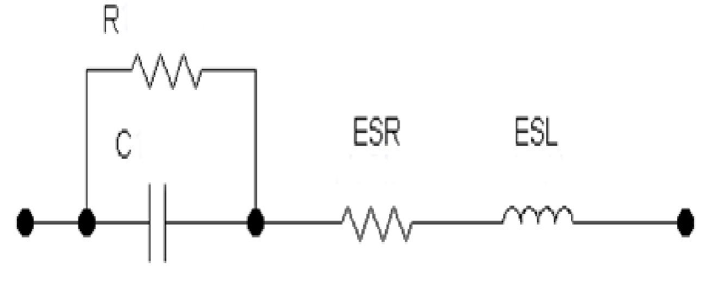
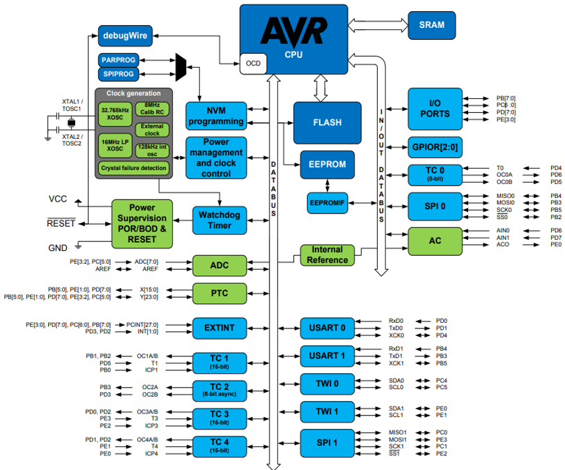
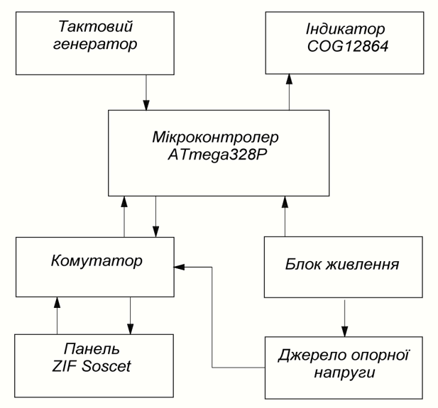
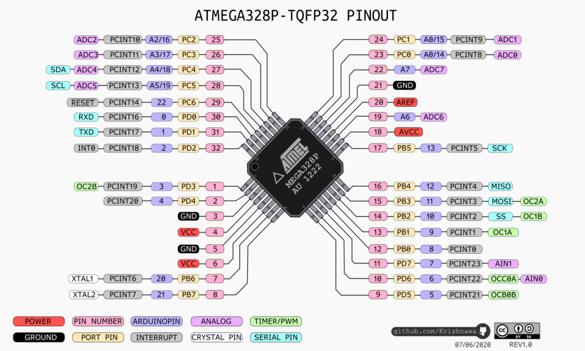
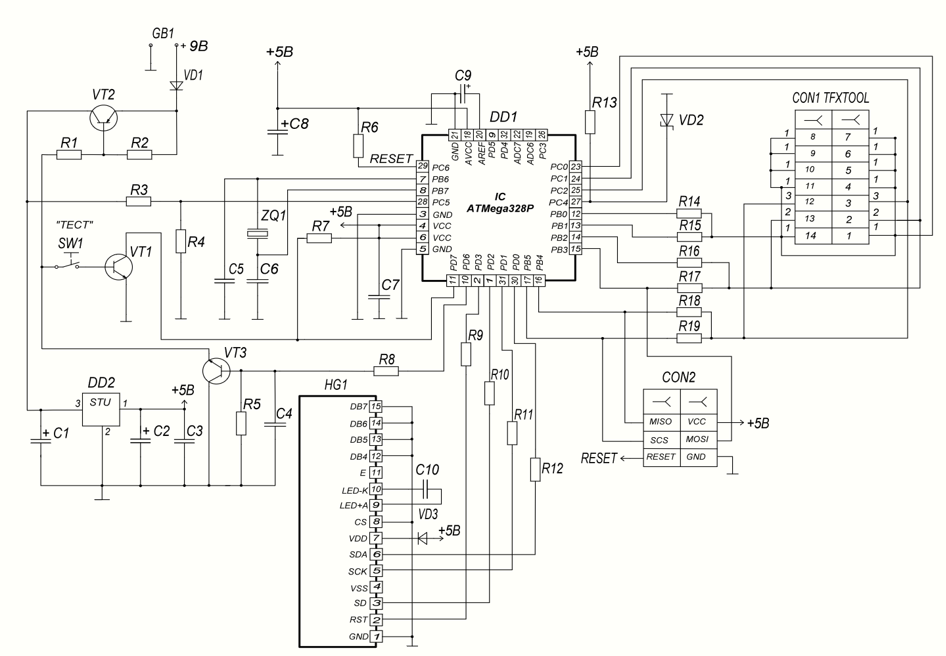

# Electronic Component Tester based on ATmega328P

> Universal measuring device for automatic detection of the type and parameters of electronic radio components based on the ATmega328P microcontroller.

The tester is an essential device for both microprocessor technology developers and radio electronics repair specialists. It allows for the automatic determination of the electronic component type, its parameters, pinout, and verification of component functionality.

A distinctive feature of the device is the ability to measure not only the capacitance of capacitors but also their Equivalent Series Resistance (ESR) and voltage loss parameter (Uloss).

---

## 📋 Main Features

The microcontroller automatically detects and determines:

- NPN and PNP transistors
- N-channel and P-channel MOSFETs
- Diodes, dual diodes
- Thyristors and triacs
- Resistors and variable resistors
- Capacitors
- Inductors

The test time is about 1-2 seconds (except for large capacity capacitors). The device control is maximally simplified and is carried out with just **one button**.

### Capacitor Measurement Features

A capacitor, in addition to its capacitance (C), has a dielectric resistance (R), an Equivalent Series Resistance (ESR), and an Equivalent Series Inductance (ESL), which creates inductive reactance. At frequencies above the resonant frequency, the ESL begins to dominate, and the capacitor behaves like an inductor.

The ESR and ESL values of capacitors are especially important for their operation in switching power supplies of computers and switching converters on motherboards. The charge and discharge currents of capacitors are large, and if the ESR value increases, the voltage drop across the capacitor increases, and the power dissipation ($P = I^2R$) also increases. Therefore, the capacitor starts to heat up and fails. Malfunctions are often caused by capacitors swelling due to overheating.

---

## ⚙️ Technical Specifications

- **System Core:** ATmega328P Microcontroller
  - Package: TQFP-32
  - Core: AVR, 8-bit
  - Clock frequency: 8 MHz
  - Operating voltage: 5 V
  - Number of timers: 3
  - Number of UARTs: 1
  - Interface types: I2C, SPI, USART
  - ADC: 10-bit, 8 channels
  - Flash memory size: 32 KB (2 KB is used for the bootloader)
  - SRAM size: 2 KB
  - EEPROM memory: 1 KB
- **Supply Voltage:** 3.6 – 9 V (a 9V Li-ion Krone battery is recommended)
- **Current Consumption:** no more than 40 mA in measurement mode, 0.1 µA in sleep mode. The total power consumption in active mode is approximately 200 - 300 mW.
- **Auto Power-Off:** 120-second timer.
- **Display:** SOG 12864 or a similar graphic indicator.
- **Capacitance Measurement Range:** 30 pF – 65000 µF (+/- 1% accuracy)
- **ESR Measurement Range:** 0 – 25 Ohm (+/- 1% accuracy)
- **Resistance Measurement Range:** 0.1 Ohm – 50 MOhm
- **Inductance Measurement Range:** 10 µH – 20 H
- **Reliability:** High reliability with a Mean Time Between Failures (MTBF) of about 917,431 hours. The microcontroller and transistors make the largest contribution to failures.
  

---

## 🛠 Principle of Operation

The core of the tester's structure is the microcontroller. The principle of the tester's operation is that the microcontroller generates a test signal, applies it through a switching device to a ZIF socket with the radio component, and analyzes the reaction of this radio component to the signal, displaying the values of its parameters on the screen. The microcontroller implements its work by executing sequential program commands, storing intermediate results, and controlling external devices.

The operating principle is based on processing input signals using the microcontroller's ADC:

1. **Type Determination:** The microcontroller applies a known voltage through resistors of various nominal values and measures the response over time. If the component's behavior matches the reference characteristics stored in the firmware, it is identified.
2. **Capacitance Measurement:** Carried out by measuring the charging time with a fixed current from the power supply. First, the microcontroller analyzes the charging process: it applies a known voltage through resistors with a known resistance, measuring the charge accumulation. If the exponent matches the capacitor's characteristic, the capacitance is calculated.
3. **ESR Measurement:** An alternating sinusoidal current is passed through the capacitor, which allows accurate determination of the signal's amplitude and phase to calculate the Equivalent Series Resistance.
4. **Inductance Measurement:** Measures the time it takes for the current through the coil to reach a certain value when connected to a DC source.

The microcontroller processes information, converts the analog signal to digital, calculates, and outputs the results to the graphic display via a 4-wire serial software SPI interface.

---

## Functional Pinout of the ATmega328P Microcontroller

## 🧩 Hardware Implementation and Schematic

The data processing is controlled by a program that is "flashed" into the microcontroller's memory using a USB programmer.

- **Measuring Circuit:** The tested capacitor is connected to pins 1 and 2 of the CON1 connector (ZIF socket). These pins are connected to port PB through high-precision reference resistors R14 - R19. The current and voltage drop across them serve as a reference for the ADC of port PC.
- **Reference Voltage:** A 2.5 V reference voltage is applied to the ADC input (pin 27 of the microcontroller) through a controlled precision zener diode VD2.
- **Power Management:** Transistors VT1, VT2, and VT3 are designed to turn the sleep mode on and off.
  - When the "TEST" button is pressed, transistor VT1 opens (connected to port PD7, which operates as an analog comparator).
  - Next, VT2 opens, supplying voltage from the battery to the stabilizer and through the R3-R4 divider to port PC5 for power monitoring.
  - To prevent the tester from turning off after releasing the button, the microcontroller sends a high-level signal to port PD6, opening VT3, which blocks the button and keeps VT2 open.
  - The results are displayed on the screen for 30 seconds. After that, the microcontroller turns off the display, closes VT3, opens the power circuit, and the device goes back into sleep mode with zero power consumption.
- **Display:** Configured and connected to the pins of port PD through voltage-limiting resistors R9 - R12 (up to 3.3 V).

---

## 📖 Operating Instructions

### Power On and Measurement

1. **Connection:** Connect the tested radio component to the universal ZIF socket or use the measuring probes (contacts 1, 2, 3).
2. **Power On:** Press the control button. The indicator will show `CEsr`, after which the battery voltage check will begin.
3. **Measurement:** The tester will automatically determine the element type and display its parameters on the screen. If the capacitance is greater than 65,000 µF, `C---` will be displayed. If the ESR is greater than 25 Ohms, `ESR---` will appear. If the capacitor is short-circuited (punctured), `Cerr` will be shown.
4. **Operating Modes:** Switching modes (Capacitance `C` -> `ESR` -> `C-ESR`) is done by shortly pressing the button.
5. **Power Off:** The device turns off automatically after 2 minutes of inactivity. For a forced shutdown, press and hold the button for more than 1 second.

> [!WARNING]
> **Important Safety Warning!**
> Always **DISCHARGE THE CAPACITOR** before connecting it to the device. Connecting a charged capacitor (especially a high-voltage one) will inevitably lead to microcontroller damage!

### Calibration

To maintain high measurement accuracy, periodic self-calibration must be performed:

1. Insert a jumper between measuring contacts 1, 2, and 3.
2. Press the control button. The device will identify the jumper and start the calibration process.
3. When the instruction to remove the jumper appears on the display, pull it out.
4. The process will continue. When the tester asks to connect a capacitor, insert a high-quality metal film capacitor with a nominal value of 0.15, 0.22, or 0.33 µF into contacts 1 and 3.
5. The display of the installed capacitor's parameters indicates the successful completion of calibration.

---

## 📦 Bill of Materials (BOM)

| Component               | Type / Value                                             | Quantity |
| ----------------------- | -------------------------------------------------------- | -------- |
| **Microcontroller**     | ATmega328P                                               | 1        |
| **Display**             | SOG 12864 Indicator                                      | 1        |
| **Crystal Oscillator**  | 8 MHz                                                    | 1        |
| **Voltage Regulator**   | 78L05                                                    | 1        |
| **Transistors**         | BC547 (2 pcs.), BC557 (1 pc.)                            | 3        |
| **Diodes**              | 1N4148 (2 pcs.), LT1004 reference voltage source (1 pc.) | 3        |
| **Precision Resistors** | SMD (0.1% accuracy for measuring circuits)               | 6        |
| **Resistors**           | SMD 5%                                                   | 13       |
| **Capacitors**          | Ceramic and film of various values                       | ~9       |
| **Connector**           | Universal ZIF socket (Socket TFX)                        | 1        |

_Note: Firmware is flashed via the SPI interface (e.g., using a USBasp programmer)._

---

## 💡 About the Project

The developed design is characterized by the simplicity of the circuit solution, a small number of components used in the schematic, attractive parameters, accessibility, and price. The tester is intended for DIY assembly and programming. Thanks to the use of the ATmega328P microcontroller, it was possible to create an effective, reliable, and convenient device with an adequate level of functionality at a moderate cost.
